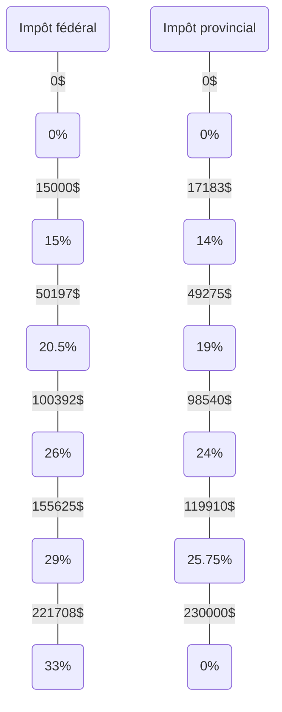

# Impôts

## Obligatoires

### Impôts fédéral et provincial (2023)

### Autres

~7% du salaire

- Assurance Emploi (AE)
- Régime québécois d’assurance parentale (RQAP)
- Régime de rentes du Québec (RRQ) (<3500$)